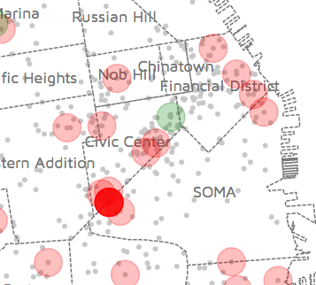
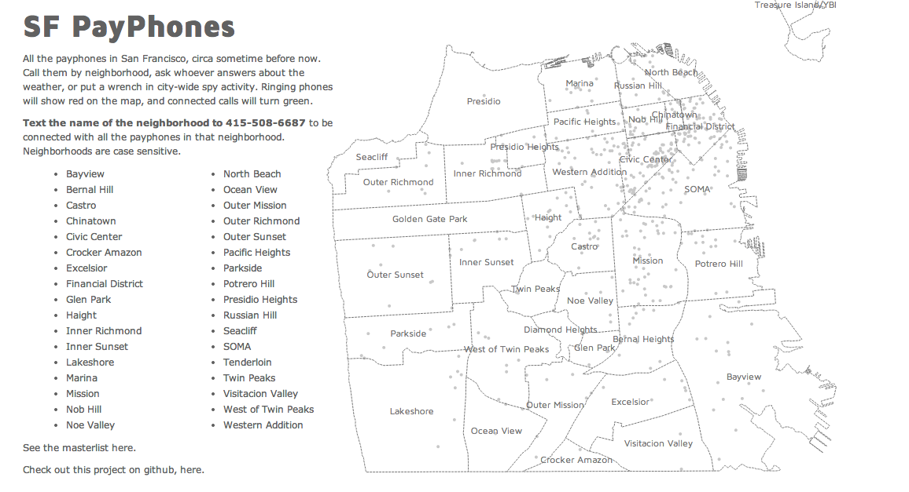

SFpayphones
===========

connecting you with a lot of pay phones 

lives at sfpayphones.urbansmore.com

This app calls an outdated (~2007) dataset of payphones in San Francisco by neighborhood, and connects the call to the first one that answers. The goal was to create a verified and correct map and dataset of payphones in San Francisco.

It uses...
--------------------
-A public google spreadsheet for the pay phone locations and numbers:
https://docs.google.com/a/emilyville.com/spreadsheet/pub?key=0AhXimdB90zwNdFk1dmlzbjNSclVkUmliQU4wU2hyOHc&output=html

-D3 to vizualize which ones are ringing 

-Ruby on Rails 

-Twilio

It looks like this
--------------------

How to use this app  
--------------------
Text the name of the neighborhood to the chosen number to be connected with all the payphones in that neighborhood. It sometimes crashes - that's a lot of phone calls. If so, just ping me. 

Bayview,
Bernal Hill,
Castro,
Chinatown,
Civic Center,
Crocker Amazon,
Excelsior,
Financial District,
Glen Park,
Haight,
Inner Richmond,
Inner Sunset,
Lakeshore,
Marina,
Mission,
Nob Hill,
Noe Valley,
North Beach,
Ocean View,
Outer Mission,
Outer Richmond,
Outer Sunset,
Pacific Heights,
Parkside,
Potrero Hill,
Presidio Heights,
Russian Hill,
Seacliff,
SOMA,
Tenderloin,
Twin Peaks,
Visitacion Valley,
West of Twin Peaks,
Western Addition

